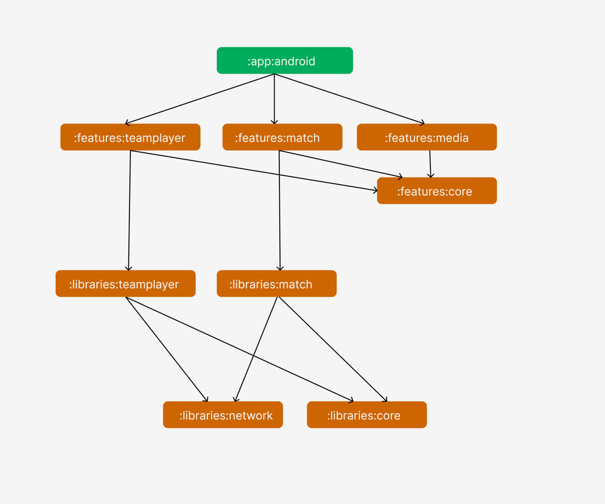

## The features could be extend
- View the state of reminder in every match to let user can add/remove the reminder for the match
- Cache data to local database to view the data when internet connection is lost
- Implement navigation component instead of call new screen directly
- Click to the team to view the details
- CLick to the previous match to view the details
- Chatting with the team when become a premium user
- View the post of teams, reaction, comment to these post
- Reaction, comment the previous match
- Bet the upcoming match..

## Architecture
- Apply modularization, divide the app to small part called 'module' to be reuse easily. Each part is a module. Each module is independent and serves a clear purpose
- Apply clean architecture in every module to make the source code easy to read, maintain
- MVVM in presentation layer (features module). Loose coupling from the View and Logic and separate the logic
- The libraries module will contain the child modules handle business logic and return pure data
- The features module will implement the UI logic and use the libraries module to handle logic

## Mockup UI
- I have used Figma to mockup the UI before implement the UI
- [Check it out](https://www.figma.com/file/HJqdg5GMYwGdusIN9eX1Tn/Zuju---UI-Mockup?node-id=0%3A1&t=F0oMzyRGSIfHJct7-1)

## Demo

https://user-images.githubusercontent.com/28387397/223627443-9215e0e7-3929-4f06-91d6-8c0e5495d40d.mp4

## Dependencies
#### Kotlin core
versions.core_ktx = '1.9.0'

#### Android core view component
versions.view_pager = '1.0.0'
versions.app_compat = '1.6.1'
versions.material = '1.8.0'

#### New API support splash screen with animation
versions.splash = '1.0.0-beta02'

#### Support concurrency handle
versions.coroutine = "1.6.4"

#### Image loader library using Coroutine
versions.coil = '2.2.2'

#### Support dependency injection
versions.hilt = '2.45'

#### Converter and Codegen library support convert JSON to POJO
versions.moshi = "1.14.0"

#### Typesafe and high performance network library
versions.retrofit = "2.9.0"
versions.okhttp = "5.0.0-alpha.2"

#### Support delegate viewmodel, view lifecycle scope management
versions.lifecycle_version = "2.5.1"
versions.fragment = "1.5.5"

#### Use for manage task, background task, periodic task, one time task
versions.work_version = "2.8.0"

#### Use for unit test
versions.junit = "4.13.2"
versions.mockito = "3.2.0"
